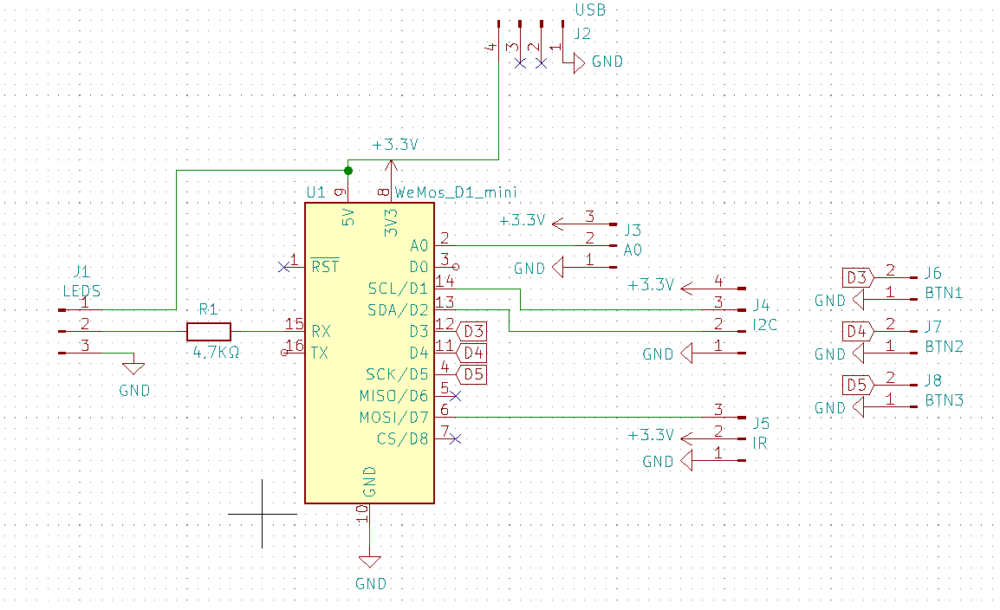

# lum0s
 
a LED strip powered by a USB power bank   
Based on https://github.com/FabLab-Luenen/McLighting

Tested Features (see McLighting repo for more information):
* Lots of animations
* Websockets control
* Web interface (sadly not really useable with phone as of now)
* E1.31 (DMX512 over WiFi) : http://www.live-leds.de/
* Retain last state
* Button Control (for now only one)
* IR Remote support
* MQTT Support

Planned features (these features will be posted on FabLab-Luenen repo)
* Microphone
* 3 buttons controls (Maybe 2 buttons to control light and 1 for choosing to enable/disable WiFi)
* PIR support
* I2C Sensors (still not a clear idea of which to use)
* SSDP / Netbios support
* Password (as for now it is unprotected)

